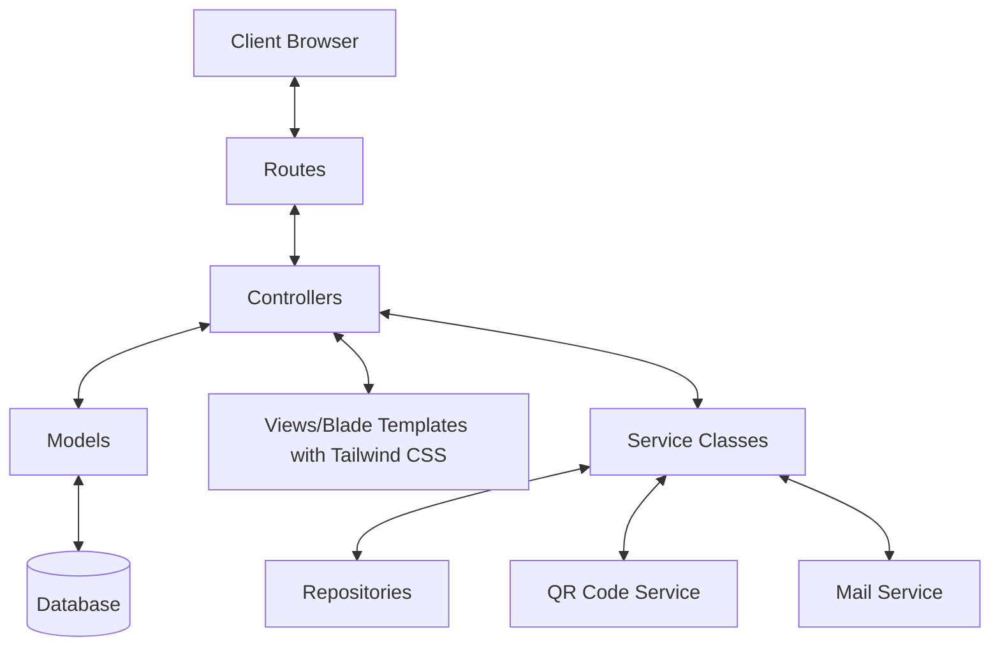
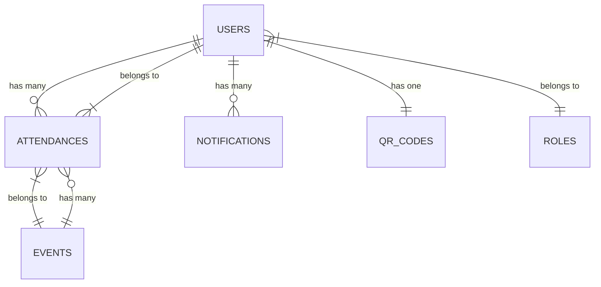

# System Patterns: AMS (Attendance Monitoring System)

## System Architecture
AMS follows Laravel's MVC architecture pattern with the following structure:

## Key Technical Decisions
- **Laravel Framework**: Chosen for its robust features, security, and developer-friendly ecosystem
- **Tailwind CSS**: Used for responsive and modern UI design
- **Repository Pattern**: Implemented to abstract database operations from business logic
- **Service Layer**: Added between controllers and repositories to handle complex business logic
- **Policy-based Authorization**: Used for fine-grained access control based on user roles
- **Queue System**: Implemented for handling email notifications asynchronously
- **QR Code Generation/Scanning**: Integrated for attendance verification
- **PHPMailer**: Used for sending email notifications to absent members

## Design Patterns in Use
- **Repository Pattern**: Separates data access logic from business logic
- **Service Layer Pattern**: Encapsulates business logic in dedicated service classes
- **Observer Pattern**: Used for event handling (e.g., attendance records trigger absence notifications)
- **Factory Pattern**: Implemented for creating complex objects (e.g., reports, QR codes)
- **Strategy Pattern**: Applied for different notification types
- **Decorator Pattern**: Used to extend functionality of core classes without modifying them

## Component Relationships

### Core Domain Models
- **User**: System users with different roles (Admin, Officer, Secretary, Member)
- **Attendance**: Records of member attendance with timestamps and approval status
- **Event**: Mass service events with dates and times
- **Notification**: System-generated notifications for absent members
- **QRCode**: Unique QR codes associated with members

### Service Components
- **AttendanceService**: Handles attendance recording and verification
- **QRCodeService**: Manages QR code generation and scanning
- **NotificationService**: Handles system notifications and email alerts
- **ReportService**: Generates attendance reports and analytics
- **UserService**: Manages user accounts and roles

## Database Schema Overview

*This document outlines the technical architecture and design patterns used in the AMS project, serving as a reference for understanding the system structure and relationships.*
